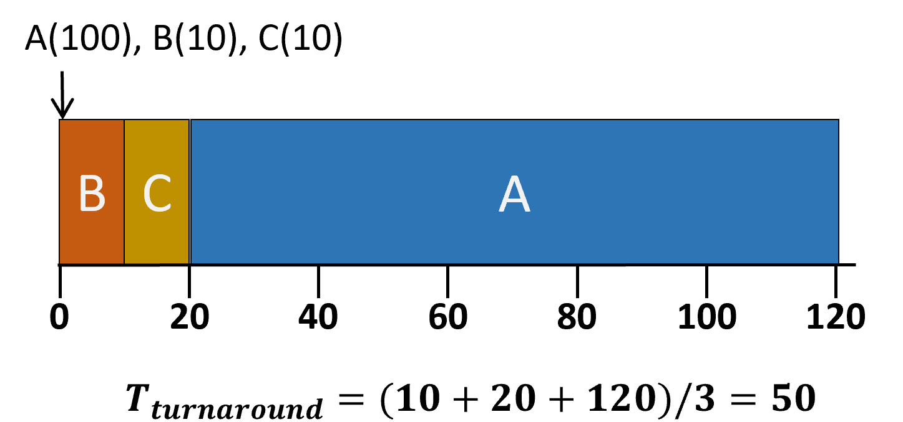
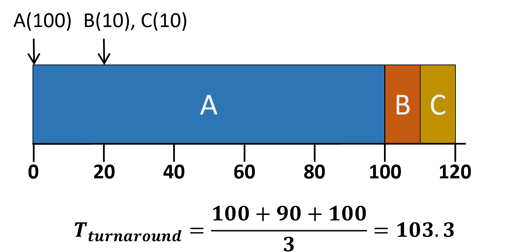
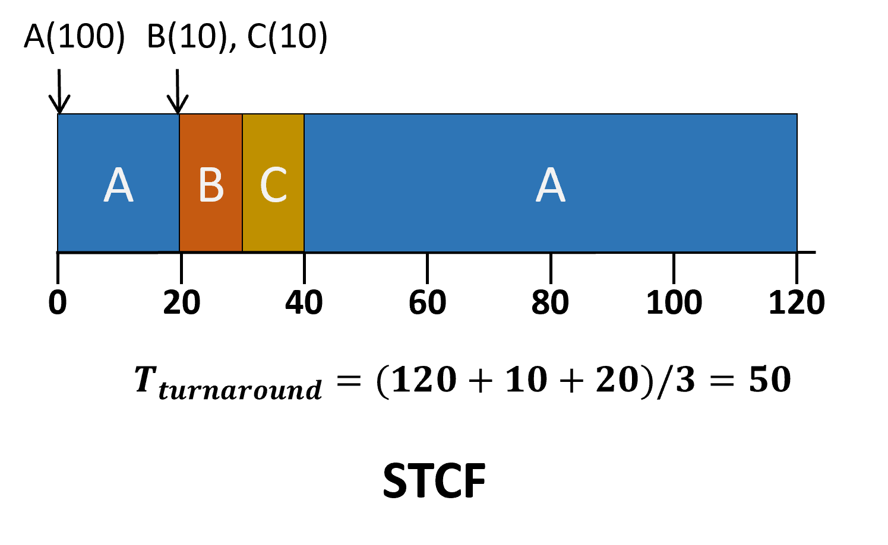
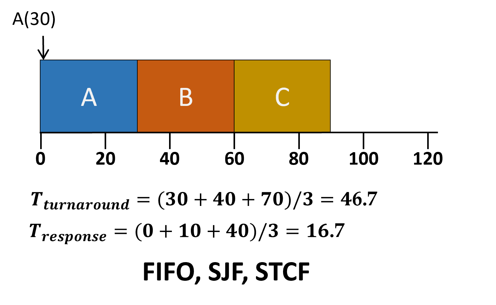

# CPU Scheduling

 

### 스케줄링이란?

> 실행 가능한 process들이 많을 때 어떤 process를 다음에 실행할지 결정하기 위한 원칙/방침
- 조건 : 오버헤드↓ / 사용률↑ / 기아현상 ↓
- 시스템에 다른 스케줄링의 목표
	1. Batch System - 최대한 많은 일을 수행
	2. Interactive System - 빠른 응답 시간
	3. Real-time System - 기한 맞추기

### Preemptive(선점) vs. Non-preemptive(비선점)

- 비선점 스케줄링 : 프로세스가 끝나거나 스스로 CPU를 양보(yield)할 때까지 기다림
- 선점 스케줄링 : 스케줄러가 강제로 프로세스를 종료하고 CPU 사용권을 회수할 수 있음

### 스케줄링 Metrics
- Turnaround Time(반환시간) = Completion Time - Arrival Time
- Response Time(응답시간) = FirstRun Time - Arrival Time
- Fairness... 등
----
### Workload Assumption
1. 모든 작업은 같은 수행 시간(RUN TIME)을 갖고 있다
2. 모든 작업은 같은 시간에 도착한다
3. 작업이 시작되면 끝날때까지 실행된다.
4. 모든 작업은 CPU만 사용한다(I/O X)
5. 모든 작업의 수행 시간을 알고 있다.

### FIFO(First In First Out)
- 작업들이 큐에 들어온 순서대로 처리된다.
- 원리, 구현 모두 간단
- 비선점 스케줄러
- ~~1. 모든 작업은 같은 수행 시간(RUN TIME)을 갖고 있다~~
- convoy effect 발생

</img>
</img>

### SJF(Shortest Job First)
- 작업마다 수행시간이 다름
- 수행시간이 짧은 작업 순서로 수행
- 비선점 스케줄러
- ~~2. 모든 작업은 같은 시간에 도착한다~~
- 똑같이 convoy effect 발생

<!-- </img> -->
<!-- </img> -->
</img>
</img>

### Shortest Time-to-Completion First(STCF)
- SJF의 선점 버전
- 새로운 작업이 들어오면 완료까지 남은 시간이 가장 적은 작업을 수행
- 반환시간은 Great, 반면 반응시간은....

<!-- </img>
</img> -->
</img>
</img>

### Round Robin(RR)
- Time Slice 만큼의 시간동안 작업을 수행하고 큐에 있는 다음 작업을 또 Time Slice 만큼 수행(모든 작업이 끝날때 까지)
- 선점 스케줄링(기아 현상X)
- 공정하지만 turnaround time↑
- Time Slice가 크면 FIFO와 차이가 없어지고, 작으면 Context Switching이 잦아져 오버헤드 증가
- I/O 작업(process가 CPU를 사용하지 않을 때) 유연하게 대처 가능

</img>
</img>
</img>
</img>
